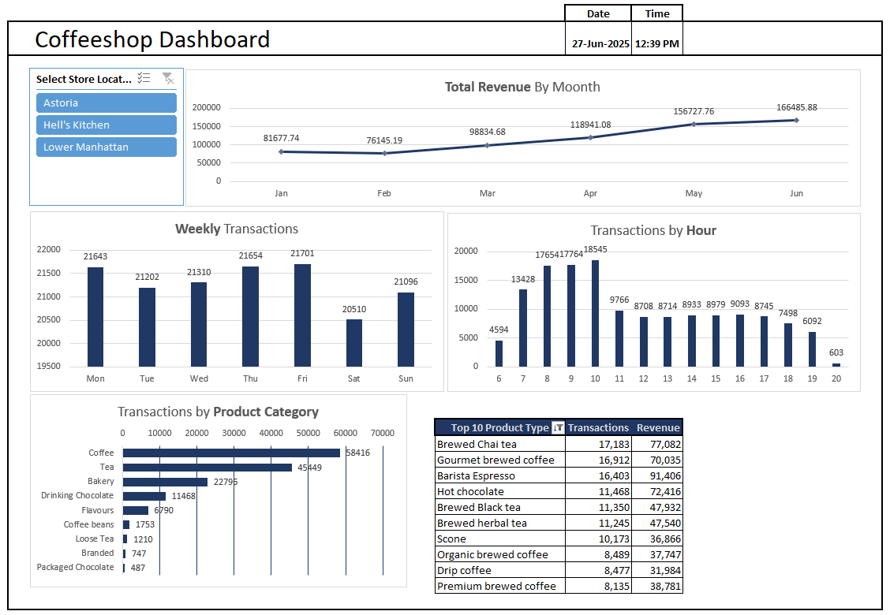

# ☕ Coffeeshop Sales & Operations Dashboard

## 📌 Project Overview
An interactive dashboard designed to analyze key sales and operational metrics of a coffeeshop chain across three New York locations: **Astoria**, **Hell’s Kitchen**, and **Lower Manhattan**. The goal is to support strategic decisions through insights on **revenue trends**, **customer traffic**, **product popularity**, and **time-based behavior**.

> 📅 Date Completed: 27-Jun-2025  
> 💼 Role: Data Analyst  
> 🛠 Tools: Excel 

---

## 📊 Key Insights

### 1️⃣ Revenue Trends by Month
- Continuous revenue growth observed from **January ($81,677.74)** to **June ($166,485.88)**.
- Highest revenue in **June**, more than double of January, signaling strong seasonal or campaign impact.

### 2️⃣ Weekly Transactions
- Highest activity on **Fridays (21,701)** and **Thursdays (21,654)**.
- **Saturdays** have the lowest transactions (20,510), indicating a possible weekend sales dip.

### 3️⃣ Hourly Transactions
- Peak hours between **8 AM to 11 AM**; **10 AM** leads with **18,545** transactions.
- Sharp decline post **12 PM**, and least activity observed after **6 PM**.

### 4️⃣ Product Category Sales
- Top-selling: **Coffee (58,416)** and **Tea (45,449)**.
- Other notable: **Bakery (22,795)**, **Drinking Chocolate (11,468)**.
- Least sold: **Packaged Chocolate**, **Branded items**.

### 5️⃣ Top 10 Products (Transactions & Revenue)
| Product Type             | Transactions | Revenue   |
|--------------------------|--------------|-----------|
| Brewed Chai Tea          | 17,183       | $77,082   |
| Gourmet Brewed Coffee    | 16,912       | $70,035   |
| Barista Espresso         | 16,403       | $91,406   |
| Hot Chocolate            | 11,468       | $72,416   |
| Brewed Black Tea         | 11,350       | $47,932   |
| Brewed Herbal Tea        | 11,245       | $47,540   |
| Scone                    | 10,173       | $36,866   |
| Organic Brewed Coffee    | 8,489        | $37,747   |
| Drip Coffee              | 8,477        | $31,984   |
| Premium Brewed Coffee    | 8,135        | $38,781   |

---

## ✅ Skills Applied
- Data Cleaning & Structuring  
- Dashboard Design & Visualization  
- Revenue & Time Series Analysis  
- Product & Customer Trend Analytics  
- Excel Data Modeling  

---

## 📈 Business Impact
- Improved inventory and staffing decisions based on hourly traffic.  
- Enhanced sales by focusing on top-selling products.  
- Insight into slow-performing hours and product categories for marketing focus.

---

## 📂 Use Cases
- Retail Business Dashboards  
- F&B Chain Sales Analysis  
- Coffee Shop Performance Reporting  
- Customer Behavior Trend Analysis

---

## 📁 File Info
- `Coffeeshop_Dashbaord.png`: Dashboard image
- `README.md`: Project documentation

---

